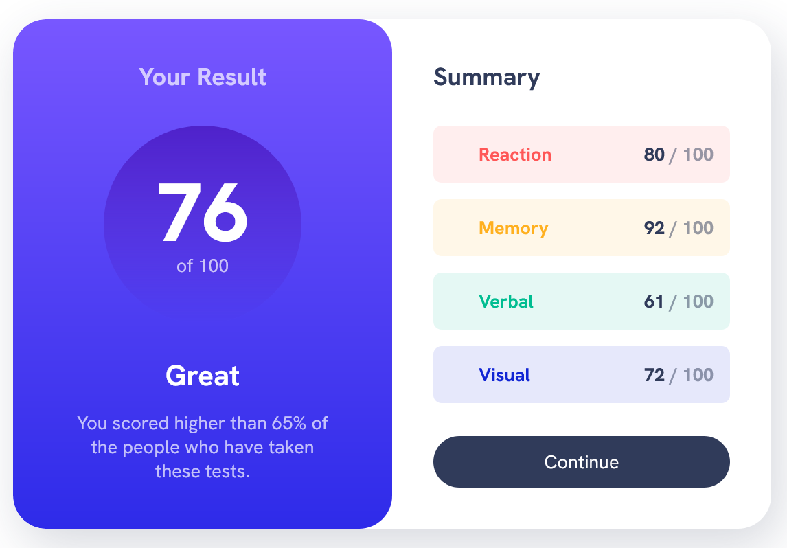
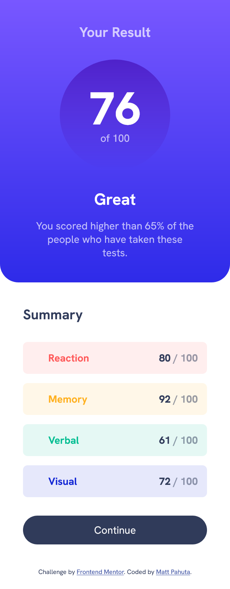

# Frontend Mentor - Results summary component solution

This is a solution to the [Results summary component challenge on Frontend Mentor](https://www.frontendmentor.io/challenges/results-summary-component-CE_K6s0maV). Frontend Mentor challenges help you improve your coding skills by building realistic projects. 
## Table of contents

- [Overview](#overview)
  - [The challenge](#the-challenge)
  - [Screenshots](#screenshots)
  - [Links](#links)
- [My process](#my-process)
  - [Built with](#built-with)
  - [What I learned](#what-i-learned)
- [Author](#author)
- [Acknowledgments](#acknowledgments)

**Note: Delete this note and update the table of contents based on what sections you keep.**

## Overview

This solution was developed in parallel with Kevin Powell's video solution for the project in order to refine my own development process, learn some modern best practice techniques, and generally sharpen my CSS skills. My solution is heavily influenced by Kevin's finished product and should be viewed as such.


### The challenge

Users should be able to:

- View the optimal layout for the interface depending on their device's screen size
- See hover and focus states for all interactive elements on the page

### Screenshots




### Links

- Solution URL: [Add solution URL here](https://your-solution-url.com)
- Live Site URL: [Add live site URL here](https://your-live-site-url.com)

## My process

### Built with

- Semantic HTML5 markup
- CSS custom properties
- Flexbox
- CSS Grid
- Mobile-first workflow

### What I learned

I'm comfortable with using CSS custom properties at a high level, but Kevin takes the usage to another level with some of these rules. For example, the class below leverages a custom property within the hsl function in order to add in the needed opacity value. Also, utilizing  another custom prop within the calc function is something I hadn't seen before. I'll look forward to using these sorts of declarations in future projects to achieve more complex results.


```css
.results {
  color: hsl(var(--clr-neutral-hsl-100), .7);
  text-align: center;
  /* utilizing the calc fun here with padding value to increase padding for left/right */
  padding: 
    var(--padding) calc(var(--padding) * 1.5);
  background: var(--gradient-primary);
  border-radius: 
    0 0 var(--border-radius) var(--border-radius);
}
```

## Author

- Website - [MattPahuta.com](https://www.mattpahuta.com)
- Frontend Mentor - [@MattPahuta](https://www.frontendmentor.io/profile/MattPahuta)
- Twitter - [@MattPahuta](https://twitter.com/MattPahuta)


## Acknowledgments

A huge Thank you to Kevin Powell for continuing to produce exceptional tutorials, learning resources, and full courses. 
