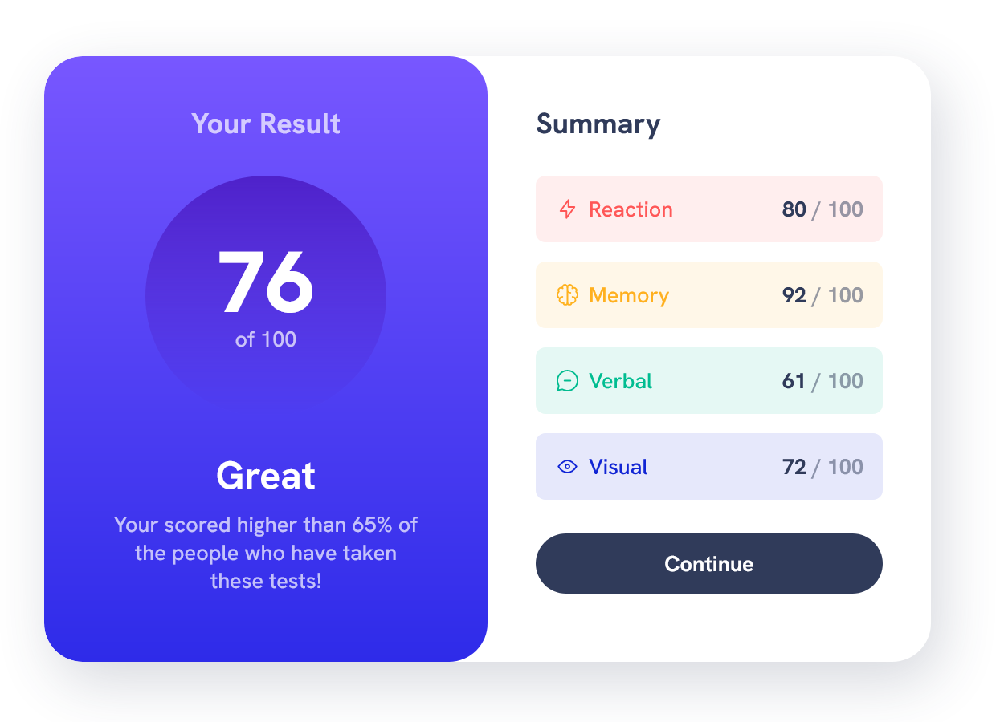
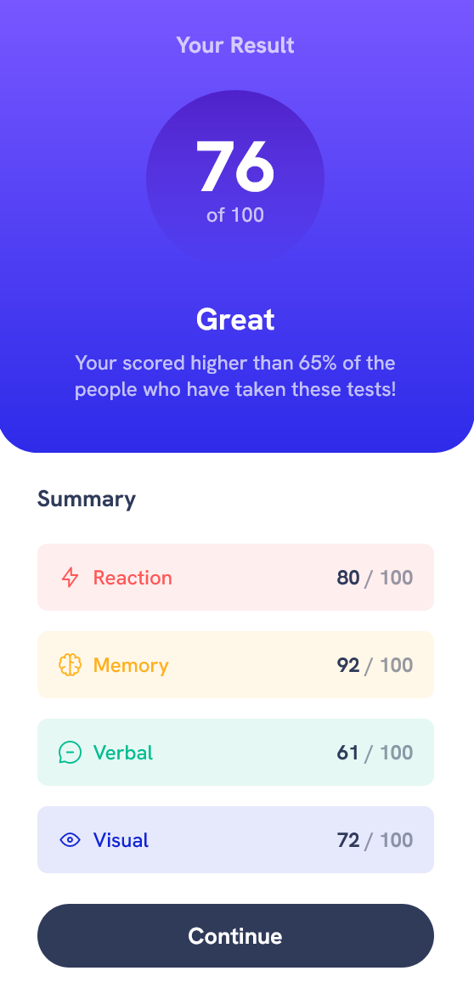

# Frontend Mentor - Results summary component solution

This is a solution to the [Results summary component challenge on Frontend Mentor](https://www.frontendmentor.io/challenges/results-summary-component-CE_K6s0maV). Frontend Mentor challenges help you improve your coding skills by building realistic projects. 
## Table of contents

- [Overview](#overview)
  - [The challenge](#the-challenge)
  - [Screenshots](#screenshots)
  - [Links](#links)
- [My process](#my-process)
  - [Built with](#built-with)
  - [What I learned](#what-i-learned)
  - [Useful resources](#useful-resources)
- [Author](#author)
- [Acknowledgments](#acknowledgments)


## Overview

I started this project in parallel with Kevin Powell's video solution for the project in order sharpen some of my CSS fundamentals and get some tips on how to refine my own dev process, particularly in the early planning and initial setup stages. Months later, I came back to the mostly finished project and began making tweaks, filling in a few gaps where some elements didn't quite match up with the design comp, and generally tidying things up. I ended up keeping a lot of the class and variable naming conventions Kevin used in his solution, but also scraped a handful of props, mainly because I wasn't entirely sure I remembered how the code was accomplishing certain styles and/or I felt an approach I was more familiar with would be better for me to maintain. Simply put, I didn't want to keep any code within the project that I wasn't reasoably confident I could explain or reproduce on my own.

Bottom line, my solution hews close to Kevin's but I've certainly spent several additional hours after watching the video walkthrough to bring it closer to where I'd normally end up on.

Additionally, stat values in my solution are derived from the provided .json file while Kevin's walkthrough utilized hard-coded values in the markup.

### The challenge

Users should be able to:

- View the optimal layout for the interface depending on their device's screen size
- See hover and focus states for all interactive elements on the page

### Screenshots




### Links

- Solution URL: [Add solution URL here](https://your-solution-url.com)
- Live Site URL: [Add live site URL here](https://your-live-site-url.com)

## My process

### Built with

- Semantic HTML5 markup
- CSS custom properties
- Flexbox
- CSS Grid
- Mobile-first workflow

### What I learned

Definitely could have achieved the same results using classes to target these elements, but using the data attributes to apply the proper styles (in this case, switching the --item-color property) was an interesting technique pulled directly from Kevin Powell's video walkthrough. Certainly seemed like an efficient approach for this particular series of elements.

```css
.summary-item[data-item-type="accent-1"] {
  --item-color: var(--clr-accent-1);
}
.summary-item[data-item-type="accent-2"] {
  --item-color: var(--clr-accent-2);
}
.summary-item[data-item-type="accent-3"] {
  --item-color: var(--clr-accent-3);
}
.summary-item[data-item-type="accent-4"] {
  --item-color: var(--clr-accent-4);
}
```

### Useful resources

- [Kevin Powell](https://youtu.be/KqFAs5d3Yl8?si=UWHPc2768xgGqKwU) - As mentioned above, much of the work on this project was accomplished in parallel with Kevin's walkthrough, From Design to Code, where he breaks down his process and approach for this project in particular and projects like this in general. As usual, it's a fantastic video and filled with valuable tips and best practices.

## Author

- Website - [MattPahuta.com](https://www.mattpahuta.com)
- Frontend Mentor - [@MattPahuta](https://www.frontendmentor.io/profile/MattPahuta)
- LinkedIn - [Matt Pahuta](www.linkedin.com/in/mattpahuta)


## Acknowledgments

A huge Thank you to Kevin Powell for continuing to produce exceptional tutorials, learning resources, and full courses. 
